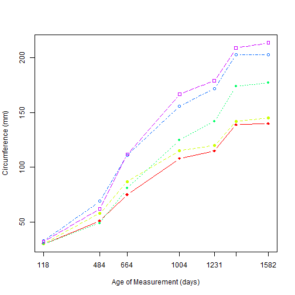

## Graph Code


```r
library(graphics)
data("Orange")
Orange$Tree <- as.numeric(Orange$Tree) 
ntrees <- max(Orange$Tree)
xrange <- range(Orange$age) 
yrange <- range(Orange$circumference) 
plot(xrange, yrange, type="n", xlab="Age of Measurement (days)",ylab="Circumference (mm)", xaxt='n') 
axis(1, at=Orange$age, labels=Orange$age)
colors <- rainbow(ntrees) 
linetype <- c(1:ntrees) 
plotchar <- seq(18,18+ntrees,1)
for (i in 1:ntrees) { 
  tree <- subset(Orange, Tree==i) 
  lines(tree$age, tree$circumference, type="b", lwd=1.5,
  lty=linetype[i], col=colors[i], pch=plotchar[i]) 
} 
axis(1, at=1:7, labels=c(118, 484, 664, 1004, 1231, 1372))
legend(xrange[1], yrange[2], trees, cex=0.8, col=colors,pch=plotchar, lty=linetype, title="Tree")
title("Tree Growth")
```

--- .class #id 

## Tree Growth Graph



```
## Error in axis(1, at = 1:7, labels = c(118, 484, 664, 1004, 1231, 1372)): 'at' and 'labels' lengths differ, 7 != 6
```

--- .class #id 
